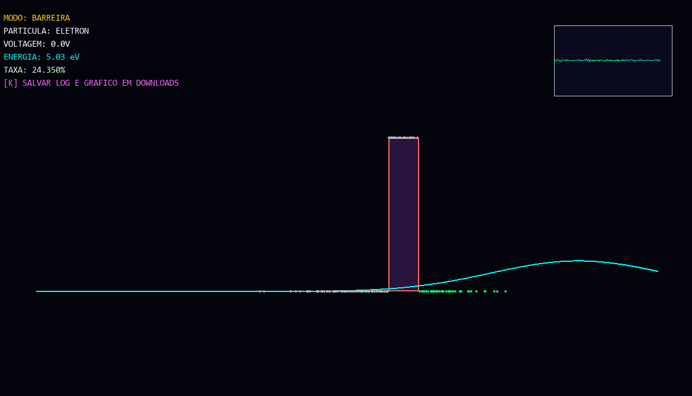
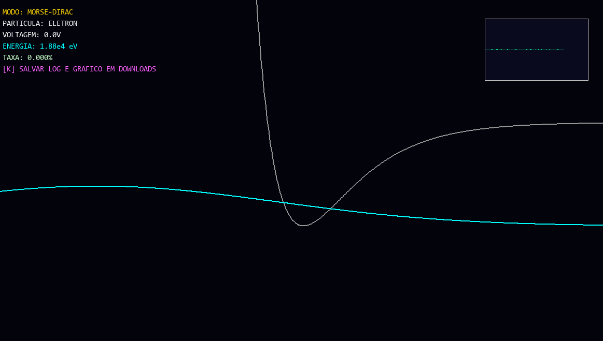
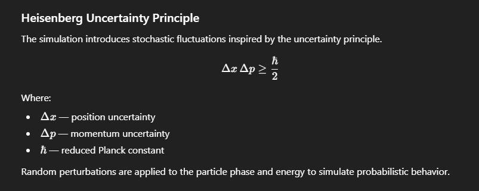
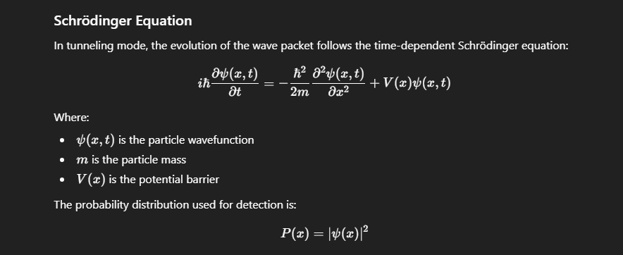
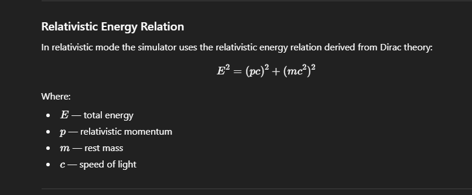
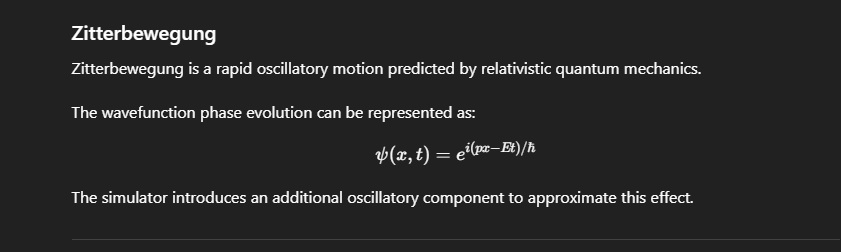

# Quantum Tunneling Simulator 

A real-time **quantum tunneling simulation** built with **Python, NumPy and Pygame**.

This project simulates the behavior of quantum particles interacting with potential barriers using simplified numerical models of real physics equations such as:

- Schrödinger Equation
- Dirac Relativistic Energy Relation
- Heisenberg Uncertainty Principle
- Zitterbewegung oscillation
- Morse Potential

The simulator calculates the evolution of a quantum wave packet in real time and visualizes the probability of tunneling events.

---

# Simulation Preview

<p align="center">

</p>

<p align="center">

</p>


---

# Features

• Real-time quantum wave packet simulation  
• Quantum tunneling through potential barriers  
• Relativistic mode based on Dirac energy relation  
• Morse potential for molecular interaction simulation  
• Heisenberg uncertainty noise in energy and phase  
• Zitterbewegung oscillation approximation  
• Energy graph visualization  
• Experimental statistics of tunneling probability  
• Export logs and experiment data  

---

# Physics Model

The simulator implements simplified numerical approximations of important quantum physics equations.

---

# Heisenberg Uncertainty Principle

<p align="center">

</p>

Δx Δp ≥ ħ / 2

The simulation introduces stochastic fluctuations inspired by the uncertainty principle.  
Random noise is applied to the particle phase and energy to simulate the probabilistic spread of the quantum wave packet.

---

# Schrödinger Equation

<p align="center">

</p>

iħ ∂ψ/∂t = −(ħ²/2m) ∂²ψ/∂x² + V(x)ψ

This equation describes the evolution of the particle wavefunction in the tunneling mode.

The probability distribution used for detection is:

P(x) = |ψ(x)|²

---

# Dirac Relativistic Energy Relation

<p align="center">

</p>

E² = (pc)² + (mc²)²

The simulator approximates relativistic particle behavior using the relativistic energy equation derived from Dirac theory.

---

# Zitterbewegung

<p align="center">

</p>

Zitterbewegung is a rapid oscillatory motion predicted by relativistic quantum mechanics.

The simulation introduces a small oscillation term to approximate this effect in the wavefunction phase evolution.

---

# Potential Systems

The simulation supports two types of potentials.

### Barrier Potential

A finite energy barrier used to demonstrate quantum tunneling.

### Morse Potential

V(x) = De (1 − e^{-a(x − re)})²

This potential is commonly used to model the vibrational behavior of diatomic molecules.

---

# Controls

| Key | Action |
|----|----|
| 1 | Barrier tunneling mode |
| 2 | Morse / Dirac mode |
| E | Electron particle |
| P | Proton particle |
| ↑ ↓ | Simulation speed |
| V / C | Adjust voltage |
| T / G | Adjust temperature |
| K | Export experiment log |
| R | Reset simulation |

---

# Installation

Clone the repository

```bash
git clone https://github.com/lfzorzetti-eng/Quantum-Tunneling-Sim.git